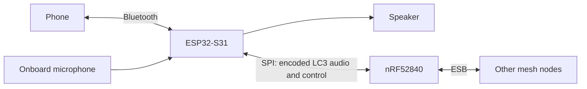

# Architecture Overview

OpenHelmet uses an ESP32-S31 Function CoreBoard-1 for audio and phone connectivity.
An optional XIAO nRF52840 Sense provides a separate mesh radio.

## System Map

The diagram shows the separate-radio setup. The nRF forwards encoded audio; it does not run the audio codec.

| Responsibility | Owner |
|---|---|
| Microphone capture, VOX, LC3 encoding and decoding | S31 |
| Playback, music mixing, and notification sounds | S31 |
| Bluetooth music, media controls, and phone-call routes | S31 |
| Buttons and application policy | S31 |
| ESB radio, mesh membership, TDMA, and relaying | nRF, when selected |
| SPI transfers | nRF master, S31 slave |

Mesh audio is 16 kHz mono. Each 20 ms audio payload contains two 10 ms LC3 frames.
VOX silence stops local encoding and audio transmission, while capture and mesh control traffic continue.

## Transport Selection

At startup, the S31 probes for a compatible LC3 nRF bridge.

- **nRF ESB:** The nRF owns mesh communication. S31 Wi-Fi and ESP-NOW are disabled; Bluetooth remains enabled.
- **ESP-NOW fallback:** Without a compatible bridge, the S31 also owns the mesh radio and TDMA schedule.

Mesh voice, Bluetooth music, and notifications can mix locally. Phone calls take priority over those playback sources.

Bluetooth music and two-way mesh voice have worked together on two nRF-equipped pairs.
Larger groups and sustained call performance still need validation.

## Details

- [Wiring and power](wiring.md)
- [Audio pipeline](audio.md)
- [Packet formats and SPI flow control](protocol.md)
- [TDMA scheduling](tdma.md)
- [Button gestures](buttons.md)
