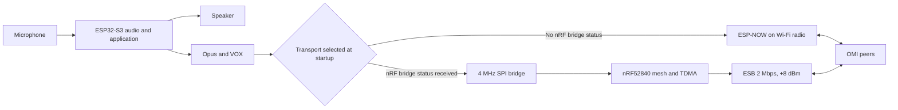

# Architecture Overview

This document describes the current OMI firmware architecture.
It also identifies goals that are not yet verified or implemented.

[TOC]

---

## 1. Current System

OMI supports two hardware configurations.

- The single-MCU configuration uses one ESP32-S3.
- The dual-MCU configuration uses one ESP32-S3 and one nRF52840.

The ESP32-S3 always owns the audio path.
It captures and plays audio.
It runs VOX and the Opus codec.
Opus on the ESP32-S3 is mandatory in both configurations.
There is no implemented codec offload to the nRF52840.

The current mesh has a fixed limit of exactly 8 nodes.
Node IDs are 1 through 8.
The TDMA slot is fixed as `node_id - 1`.

The firmware has no Bluetooth audio integration.
No Bluetooth stack is started at run time.
Bluetooth phone and legacy intercom support are future work.

## 2. Configuration Selection

The ESP32-S3 probes the inter-MCU bridge during startup.
It selects the nRF52840 transport when it receives bridge status.
Otherwise, it starts the ESP-NOW transport.

The transports use different radios and addresses.
They are not interoperable over the air.

| Configuration | Radio transport | Mesh owner | TDMA owner |
|---|---|---|---|
| ESP32-S3 | ESP-NOW on the ESP Wi-Fi radio | ESP32-S3 | ESP32-S3 |
| ESP32-S3 + nRF52840 | Nordic ESB at 2 Mbps and +8 dBm | nRF52840 | nRF52840 |

ESP-NOW is a transport on the ESP32-S3 Wi-Fi radio.
It is not Bluetooth and it is not an independent radio.

## 3. Component Ownership

### ESP32-S3

The ESP32-S3 owns these functions:

- 16 kHz mono audio capture and playback
- 16-bit PCM processing in 20 ms frames
- VOX and silence suppression
- Opus encode, decode, DTX, and packet-loss concealment
- remote-source buffering and mixing
- notification audio
- buttons and application policy
- application and audio telemetry
- ESP-NOW mesh and TDMA in the single-MCU configuration
- the SPI slave in the dual-MCU configuration

The mixer has 3 remote-source slots.
Each slot has independent packet, decoder, and resampler state.
This mixer limit is separate from the relay-grant limit.

### nRF52840

The nRF52840 owns these functions in the dual-MCU configuration:

- the ESB radio
- mesh membership and coordinator state
- RF slot and control deadlines
- relay queues and relay grants
- TDMA synchronization
- the SPI master
- I2S WS edge measurement for local clock discipline

## 4. Inter-MCU Bridge

The dual-MCU bridge uses these signals:

- 4 MHz full-duplex SPI
- one 256-byte SPI transaction every 2 ms
- one nRF-to-ESP ACK GPIO
- one ESP I2S WS signal to the nRF52840

The SPI frame contains a sync byte, length, sequence, type, payload, and CRC8.
The ESP keeps one audio frame in flight until the nRF gives the GPIO ACK.
The nRF gives the ACK after durable audio admission.
The ESP retries the same frame while it waits.
A 50 ms timeout prevents a lost ACK from blocking the bridge.

The WS signal is not an audio-data link.
The nRF counts its rising edges with hardware peripherals.
The nRF coordinator uses valid samples to discipline its TDMA period.

See [Inter-MCU Contract](inter_mcu.md) for the bridge details.

## 5. Audio Path

The current transmit path is:

1. The ESP captures 320 PCM samples.
2. VOX marks the 20 ms frame as active or inactive.
3. The ESP always runs the frame through Opus.
4. DTX suppresses small inactive frames.
5. The selected transport queues eligible audio for the local TDMA slot.

The current receive path is:

1. The transport admits a packet by source ID.
2. The ESP assigns the source to one of 3 remote-source slots.
3. The packet store waits for 3 packets or a 60 ms prefill deadline.
4. Opus decodes audio or generates concealment audio.
5. The resampler controls each source buffer depth.
6. Active remote sources are summed and saturated to 16-bit PCM.
7. The ESP writes the result to I2S.

The nRF transport can bundle the current Opus frame with up to two predecessor
frames. It can remove predecessor data when the remaining slot airtime is too
short. The ESP-NOW path uses the basic audio packet path.

See [Audio Pipeline](audio.md) for codec and playout details.

## 6. Latency Status

The current end-to-end latency is not externally measured.
The firmware does not prove a latency below 80 ms.
The internal latency field is not an end-to-end measurement.
It estimates local processing and I2S DMA time only.

The receive path can prefill 3 audio packets or wait 60 ms.
It also has packet, resampler, TDMA, bridge, and I2S buffering.
The actual current end-to-end latency is therefore likely greater than 80 ms.
This must be verified with an external acoustic or wired measurement.

A latency below 80 ms remains a design target.
It is not an implemented or verified property.

## 7. Mesh and TDMA

Both transports use a 20 ms frame.
Each frame has 8 fixed voice slots of 2 ms.
Each slot has a 500 us guarded deadline.
The control window starts at 16 ms and ends at 18 ms.
The interval from 18 ms to 20 ms is an unused frame tail.

Every tenth frame reserves the control window for coordinator SYNC.
This gives a nominal SYNC interval of about 200 ms.
Other joined-node control windows use a rotating owner.

Discovery is an exception to joined-node ownership.
An unassigned node cannot own a slot.
ESP-NOW JOIN uses bounded randomized contention.
The ESB join path uses bounded direct retries and scan backoff.
Shutdown LEAVE can also bypass normal queued ownership.
These exceptions do not provide a general CSMA voice mode.

See [TDMA Scheduling](tdma.md) for the exact schedule.

## 8. Coordinator Duties

The coordinator has more duties than time synchronization.
It performs these functions:

- uses node ID 1 and slot 0 when it forms a mesh
- assigns the first free node ID
- assigns slot `node_id - 1`
- sends JOIN acknowledgements
- publishes the SLOT_MAP
- sends periodic SYNC
- tracks peer liveness
- removes timed-out peers
- selects up to 2 active speakers for relay grants
- computes and publishes relay masks
- resolves a coordinator conflict by radio address

The SLOT_MAP reports current membership, grants, and relay masks.
The implementation does not optimize slot order.
It does not ACK SLOT_MAP records.
It does not defer SLOT_MAP application to a negotiated frame boundary.

## 9. Relay Model

Ordinary audio is single-hop.
Only coordinator-granted audio is eligible for relay.
The coordinator can grant at most 2 speakers at one time.
A node relays a granted source only when its bit is in that source's relay mask.

The audio header starts with TTL 2.
A selected relay decrements it to 1 and transmits in its own slot.
A receiver would decrement it to 0, but the relay queue rejects TTL 0.
The current result is one relay transmission after the source transmission.
The TTL value does not create two implemented relay transmissions.

Duplicate suppression and bounded queues limit repeated work.
Local and relay audio share the node's one transmit opportunity per frame.

## 10. Membership and Failure Behavior

A node starts in `SCANNING`.
It joins a valid coordinator or becomes a coordinator after its scan timeout.
A participant suppresses TDMA transmission until it acquires valid SYNC.

KEEPALIVE and STATUS maintain liveness when voice is silent.
A peer times out after 3 seconds without a refreshing packet.
A participant that loses coordinator SYNC stops TDMA and scans again.
It does not use CSMA PTT as a fallback.

A partition can form an independent coordinator and schedule.
When coordinators later hear each other, the lower radio address wins.
The higher-address coordinator demotes and joins the winner.
This permits partitions to merge.

## 11. Telemetry

Telemetry is implemented on both MCUs.
The firmware reports counters for these areas:

- audio capture, encode, decode, playout, and underrun
- source admission, sequence gaps, and recovered predecessor frames
- SPI framing, retries, ACK timeouts, and queue drops
- mesh ingress, RF transmit, RF receive, relay, and control queues
- TDMA deadlines, late work, timer correction, and reacquisition
- ESB completion, timeout, FIFO, and RX restart behavior
- diagnostic packet round-trip time and jitter

These values locate loss and timing faults.
They do not prove acoustic end-to-end latency, delivery, or battery life by
themselves.

## 12. Goals and Future Work

These items are targets. They are not current verified behavior.

- Verify end-to-end voice latency below 80 ms with external equipment.
- Measure power use and battery runtime on production hardware.
- Add Bluetooth phone and legacy intercom integration.
- Validate synchronization and delivery under mobility and interference.
- Decide whether more than one relay transmission is required.

The project preserves a simple design rationale.
Fixed resources bound memory and airtime.
TDMA limits transmit opportunities.
The dual-MCU option isolates RF scheduling from audio and application load.
These choices reduce failure scope, but they do not replace measurement.
