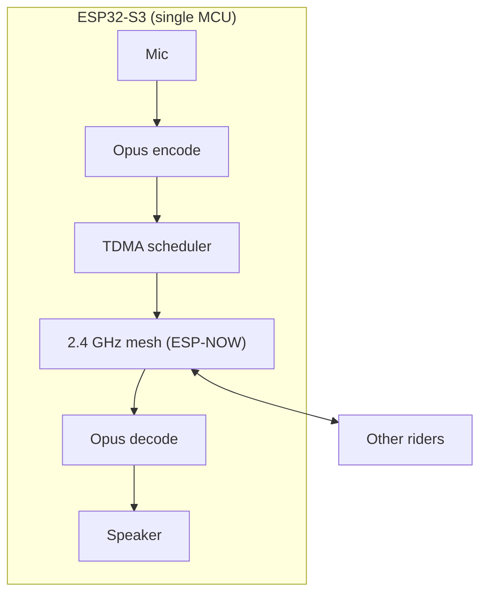
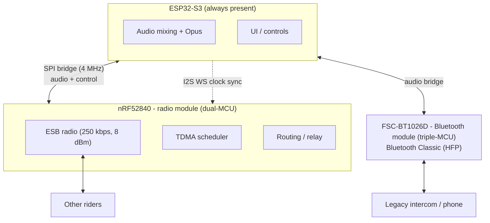

# Architecture Overview

This document describes the **system architecture** of the Open Motorcycle Intercom (OMI) project. It explains how audio, networking, timing, and interoperability are structured, and why these design decisions were made.

The architecture is intentionally **layered and evolutionary**: it works with a single MCU today and cleanly evolves into a dual-MCU, production-grade system.

[TOC]

---

## 1. Architectural Goals

The architecture is driven by the following non-negotiable goals:

- Deterministic, low-latency voice (<80 ms end-to-end)
- Predictable scaling for 4-8+ riders
- Battery life of 8-16 hours active use
- Open, inspectable protocol
- Compatibility with legacy Bluetooth intercoms

General-purpose networking stacks (Wi-Fi, BLE mesh, Bluetooth Mesh) fail these goals and are therefore excluded.

---

## 2. Layered System Model

OMI is structured in **four logical layers**:

```
+--------------------------------------------------+
| Application Layer                                |
|  - Audio mixing                                  |
|  - VOX / PTT                                     |
|  - Group management                              |
+--------------------------------------------------+
| Audio Layer                                      |
|  - Opus encoder / decoder                        |
|  - Jitter buffer                                 |
|  - Packet loss concealment                       |
+--------------------------------------------------+
| Transport Layer                                  |
|  - TDMA (voice)                                  |
|  - CSMA (control)                                |
|  - Routing / relaying                            |
+--------------------------------------------------+
| Radio / Hardware Layer                           |
|  - ESP32-S3 (single-MCU)                         |
|  - nRF52840 + ESP32-S3 (dual-MCU)                |
+--------------------------------------------------+
```

Each layer has a strict responsibility boundary. No layer assumes details of the one below it.

---

## 3. Single-MCU Architecture

### Overview

The single-MCU design prioritizes **speed of development and validation**.

- One ESP32-S3 per rider - the modular base; no external radio or Bluetooth chip required
- Single firmware image
- Custom 2.4 GHz mesh over ESP-NOW
- No Bluetooth Classic interop in this configuration (that needs the FSC-BT1026D - see the dual-/triple-MCU configuration)



### Responsibilities of ESP32-S3

- Audio capture and playback
- Opus encode/decode
- TDMA slot timing
- Mesh packet forwarding (ESP-NOW)
- Basic UI (buttons, LEDs)

### Why This Works

- ESP32-S3 has enough CPU for Opus @ 8-16 kbps
- A single ESP32-S3 is a complete, self-contained node (no external radio or BT chip needed)
- Single MCU reduces complexity early

### Known Limitations

- Higher power consumption
- Less deterministic radio timing

These limitations are acceptable for an MVP.

---

## 4. Dual- and Triple-MCU Architecture

### Rationale

The design is **modular**: the ESP32-S3 is always present and works on its own (single-MCU). Two optional modules can be added independently:

- **nRF52840 (dual-MCU)** - a dedicated radio module for deterministic ESB timing and lower power, isolated from the application MCU.
- **FSC-BT1026D (triple-MCU)** - a Bluetooth Classic (HFP) module for legacy intercom / phone interop, since the ESP32-S3 has no BT Classic radio.

Bluetooth Classic is power-hungry and timing-hostile, so isolating it on its own SoC keeps it off the mesh radio's timing path. The diagram below shows the full triple-MCU build; either optional module can be omitted.



### nRF52840 Responsibilities

- Raw 2.4 GHz radio (ESB)
- TDMA timing and synchronization
- Packet routing and relaying
- Mesh topology management
- Ultra-low-power operation

### ESP32-S3 Responsibilities

- Bridge audio to/from the FSC-BT1026D Bluetooth Classic (HFP) SoC, when the Bluetooth module is present
- Audio mixing (mesh + Bluetooth)
- Opus encode/decode (optional future offload)
- User interface

### Benefits

- Deterministic mesh timing
- Significantly lower average power
- Bluetooth complexity isolated
- Easier RF tuning and certification

---

## 5. Audio Data Flow

### Capture to Playback

1. Microphone samples @ 16 kHz mono
2. Opus encodes 20 ms frames
3. Encoded frames placed in TDMA slot
4. Frames forwarded or relayed
5. Receiver decodes via Opus
6. Jitter buffer smooths arrival
7. Audio played to speaker

### Latency Budget (Target)

| Stage | Budget |
|-----|-------|
| Capture + Encode | 10-20 ms |
| TDMA wait | 0-20 ms |
| Forwarding | 5-15 ms |
| Jitter buffer | 10-20 ms |
| Decode + Playback | 10-15 ms |
| **Total** | **<80 ms** |

---

## 6. TDMA Frame Design (Conceptual)

### Fixed Frame Duration

- Frame length: 20 ms (aligned with Opus)
- Slots allocated dynamically

Example (5 riders):
```
| A | B | C | D | E |
```

Each slot carries:
- One Opus frame
- Minimal header (node ID, hop count)

### Synchronization

- One node acts as time master
- Others phase-lock
- Re-election on master loss

Motorcycle groups change slowly, simplifying this process.

---

## 7. Control Plane (CSMA)

Control traffic uses contention-based access:

- Join / leave requests
- Slot negotiation
- Topology updates
- Battery status

Control packets are low-rate and tolerant to delay.

---

## 8. Routing Model

- Small group sizes
- Linear physical topology
- Limited hop count (typically ≤2)

Routing is explicit and simple:
- Forward only when necessary
- Drop stale frames
- No global flooding

This prevents exponential packet growth.

---

## 9. Interoperability Boundary

Bluetooth Classic integration **never touches the mesh layer**.

- Bluetooth audio appears as just another audio source
- Mesh does not care whether audio is local or Bluetooth

This keeps the core protocol clean and open.

---

## 10. Failure Modes & Degradation

Designed degradations:

- Loss of sync → fallback to CSMA PTT
- Mesh split → independent sub-groups
- Bluetooth disconnect → mesh unaffected

Silence is preferred over garbled audio.

---

## 11. Architectural Principles

- Determinism beats bandwidth
- Isolation beats cleverness
- Small meshes beat global ones
- Audio quality beats feature count

---

## 12. Status

This architecture document is **normative** for the project. Future changes must justify deviations against the goals defined here.

