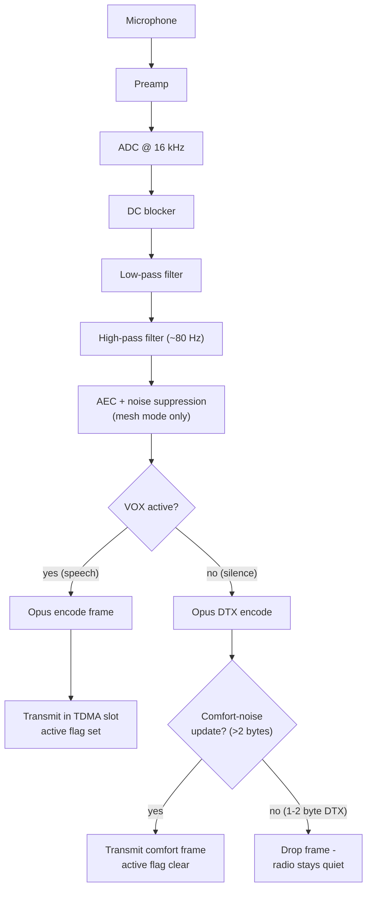

# Audio Pipeline & Voice Processing

This document defines the **audio architecture** of the Open Motorcycle Intercom (OMI).

Audio is the product. Everything else exists to serve it. The system is optimized for **clear speech, low latency, and robustness under packet loss**, not hi‑fi quality.

[TOC]

---

## 1. Audio Design Goals

- End‑to‑end latency < 80 ms
- Intelligible speech at highway speeds
- Graceful degradation under packet loss
- Minimal CPU and power usage
- Simple, deterministic processing pipeline

Music playback and stereo quality are explicitly out of scope.

---

## 2. Audio Signal Chain (Local)

The reverse chain applies for received audio (Opus decode -> jitter buffer ->
PLC/comfort-noise -> DAC). The AEC/noise-suppression stage runs only in mesh mode
(it needs the far-end reference from decoded peer audio).

---

## 3. Sampling Parameters

| Parameter | Value | Rationale |
|---------|------|-----------|
| Sample rate | 16 kHz | Speech‑optimized, low CPU |
| Channels | Mono | No spatial benefit in helmets |
| Bit depth | 16‑bit | Internal processing |

16 kHz is the lowest rate that preserves consonant clarity.

---

## 4. Microphone Considerations

Recommended:
- Electret or MEMS mic with good wind tolerance
- Directional or noise‑canceling if possible

Hardware assumptions:
- Wind noise is unavoidable
- DSP must tolerate broadband noise

A **high‑pass filter (~80 Hz, default)** removes engine rumble.

---

## 5. VOX & Push‑To‑Talk (PTT)

### VOX Behavior

- Default activation method
- Energy‑based (RMS) threshold with hysteresis
- Activation threshold ~0.03 RMS, deactivation ~0.010 RMS (defaults)
- Hangover timer (500 ms default) and a minimum-active duration (500 ms default)
  to avoid clipping word tails and chattering

Rules:
- VOX gates **transmission**, not the codec: when VOX is inactive the encoder
  still runs (in DTX mode) but the radio is kept quiet - see §5.1.
- A test knob (`FORCE_TX_ALWAYS_FOR_TEST`, default **0**) can force continuous
  TX for bring-up/debugging.

### 5.1 Silence Suppression (Opus DTX)

Continuous transmission during silence wastes airtime and power, so the encoder
runs with **Opus DTX (discontinuous transmission)** enabled:

- While VOX is active, every 20 ms frame is encoded and transmitted (active flag set).
- While VOX is inactive, a zeroed frame is fed to the DTX encoder. Opus emits a
  small **comfort-noise (SID) update** at the start of the silence period and
  roughly every 400 ms thereafter, returning a 1-2 byte DTX frame in between.
- Only the comfort-noise updates are transmitted; the 1-2 byte DTX frames are
  **dropped before TX**, so the radio goes quiet during silence.
- Each frame carries an `active` flag. The receiver uses it to treat a gap as
  **intentional silence** (output comfort noise / true silence, no false
  underrun/glitch accounting) rather than packet loss.

Liveness does not depend on audio: KEEPALIVE/STATUS/SYNC continue on their own
cadence, so a silent node is **not** dropped from the mesh (see protocol.md).

### PTT Behavior

- Overrides VOX
- Forces continuous TX while pressed

Both methods feed the same pipeline.

---

## 6. Opus Codec Configuration

Opus is mandatory. No fallback codecs are planned.

### Encoder Settings

| Setting | Value |
|------|------|
| Mode | VoIP |
| Sample rate | 16 kHz |
| Channels | 1 |
| Frame size | 20 ms |
| Bitrate | 12 kbps (default; `opus_bitrate` configurable) |
| VBR | Enabled |
| FEC | Enabled (inband) |
| DTX | Enabled (silence suppression - see §5.1) |
| Complexity | 5 (medium) |

Lower bitrates reduce range reliability; higher bitrates waste power.

---

## 7. Opus Framing & Packetization

- Exactly **one Opus frame per TDMA frame**
- No fragmentation
- No aggregation

This enforces deterministic timing and simplifies buffering.

---

## 8. Jitter Buffer Design

### Purpose

Absorbs:
- Slot timing jitter
- Multi‑hop delay variation

### Configuration

- RX queue size: 8 frames
- Prefill before playout starts: 2 frames
- Max target depth (backlog trimmed above this): 4 frames

### Behavior

- Playout starts once the prefill threshold is reached.
- Adaptive playout: a one-frame **hold** (PLC fill) lets the queue refill when it
  empties, and a **catch-up** discard burns off latency when the queue grows past
  the steady-state depth.
- Late/backlogged packets above the max target are dropped.
- Empty polls during active playout fall back to Opus PLC for a grace window
  (~100 ms) before counting an underrun. Underruns are only counted when a packet
  arrived recently (<200 ms); during **intentional silence** (DTX, see §5.1) empty
  polls are expected and are not counted as underruns or glitches.

Buffer growth is tightly bounded to protect latency.

---

## 9. Packet Loss Concealment (PLC)

Opus PLC is relied upon heavily.

Expected behavior:
- Single packet loss: barely audible
- Burst loss: brief muffling, not silence

No retransmissions are attempted.

---

## 10. Audio Mixing Model

### Mesh Audio

- One active speaker at a time (typical usage)
- Multiple streams possible but discouraged

Mixing strategy:
- Simple summation
- Soft limiter to prevent clipping

### Bluetooth Audio Integration

Bluetooth audio appears as an additional input stream.

Rules:
- Bluetooth stream is mixed at lower priority
- Mesh audio always takes precedence

---

## 11. Priority & Ducking

When mesh audio is active:
- Bluetooth audio is attenuated or muted

When Bluetooth call is active:
- Mesh audio may be mixed or paused (configurable)

This avoids cognitive overload.

---

## 12. Latency Budget (Audio Path)

| Stage | Typical Latency |
|-----|----------------|
| ADC + prefilter | 2–3 ms |
| VOX decision | <1 ms |
| Opus encode | 5–10 ms |
| TDMA wait | 0–20 ms |
| Opus decode | 5–8 ms |
| DAC + output | 2–3 ms |
| **Total** | **<80 ms** |

Worst‑case latency is bounded by design.

---

## 13. CPU Load Estimates

### ESP32‑S3

- Opus encode: ~10–15% CPU
- Opus decode: ~8–12% CPU
- Mixing + VOX: <5%

### nRF52840

- Significantly lower relative load

Audio processing fits comfortably within budget.

---

## 14. Failure Modes & Degradation

| Condition | Result |
|--------|-------|
| High packet loss | PLC smoothing |
| CPU overload | Audio drop (preferred) |
| Buffer overrun | Packet drop |

Distortion is avoided even if silence occurs.

---

## 15. Audio Debugging Hooks

Recommended metrics:
- Encode time per frame
- Jitter buffer depth
- Packet loss rate
- PLC activation count

These are essential for field tuning.

---

## 16. Design Rationale Summary

- 16 kHz mono is sufficient and efficient
- One frame per slot simplifies everything
- PLC beats retransmission
- Mixing is intentionally simple

Clarity beats cleverness.

---

## 17. Status

This document defines the **authoritative audio behavior** for OMI.

Any changes must preserve latency and power guarantees.

