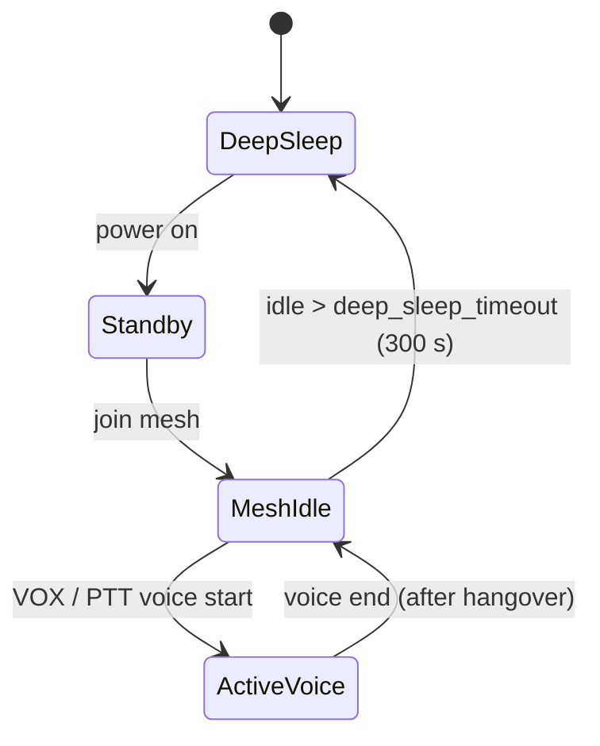

# Power Budget & Battery Design

This document defines the **power model, state machine, and battery budget** for the Open Motorcycle Intercom (OMI).

Power is a **first-class design constraint**. Any feature that breaks the power budget is considered a bug.

[TOC]

---

## Power Targets

### Usage Targets

- **Active riding:** 8–16 hours
- **Standby (powered on, idle):** multiple days
- **Deep sleep:** weeks

### Power Budget Summary

| Mode | Target | Phase 3 Measured (ESP32-S3) |
|----|---------------------|-----------------------------|
| Active voice | ≤150 mW | ~190 mW (57mA @ 3.3V) |
| Mesh idle | ≤40 mW | ~190 mW (57mA @ 3.3V) |
| Standby | ≤5 mW | TBD |
| Deep sleep | <10 µA | TBD |

> [!NOTE]
> Measurements show ESP32-S3 WiFi always-listening mode draws ~57mA
> regardless of traffic. The ≤40mW mesh idle target requires aggressive
> duty cycling (on nRF52) or protocol-level sleep scheduling.

---

## Battery Assumptions

### Battery Type

- Single-cell Li-Po
- Nominal voltage: 3.7 V
- Charge voltage: 4.2 V

### Capacity Range

| Capacity | Energy |
|--------|--------|
| 1000 mAh | ~3.7 Wh |
| 1500 mAh | ~5.6 Wh |

Helmet-mounted constraints favor **1000–1500 mAh**.

---

## System Power States

OMI firmware operates as a **strict power state machine**.



> Currently implemented: `MeshIdle <-> ActiveVoice` (VOX-driven) and deep-sleep
> entry. `Standby` and full deep-sleep optimization are partially implemented -
> see the status note above.

Transitions are explicit and measurable.

> **Implementation status:** The `MESH_IDLE <-> ACTIVE_VOICE` transition is
> implemented and VOX-driven (`power_notify_voice_start/end`). Deep-sleep entry
> exists (`power_enter_deep_sleep`, idle timeout `deep_sleep_timeout_sec`, default
> 300 s) but is not yet fully power-optimized, and radio duty-cycling
> (`power_radio_slot_start/end`) is implemented but **disabled by default**
> (`enable_radio_duty_cycle = false`). The current draw figures below are design
> **targets**, not enforced/measured limits unless explicitly noted.

---

## Power State Definitions

### 4.1 Deep Sleep

Used when:
- Device powered off
- Long-term inactivity

Characteristics:
- Radio off
- Audio off
- RTC only

Typical current:
- ESP32-S3: <10 µA
- nRF52840: ~1–2 µA

---

### Standby

Used when:
- Powered on
- Not connected to a mesh

Characteristics:
- Periodic beacon listening
- UI active

Typical power:
- 3–10 mW

---

### Mesh Idle

Used when:
- Joined to mesh
- No active speech

Characteristics:
- TDMA sync only
- No audio encoding
- VOX monitoring

Typical power:
- ESP32-S3: ~190 mW (57mA @ 3.3V) — **Phase 3 measured**
- nRF52840: ~10–20 mW (target for Phase 6)

---

### Active Voice

Used when:
- Local speech detected (VOX/PTT)
- Relaying audio

Characteristics:
- Opus encode/decode active
- Radio TX/RX bursts
- TDMA slot usage

Typical power:
- ESP32-S3: 120–180 mW
- nRF52: 30–60 mW

---

## Duty Cycle Model

Active voice is **bursty**, not continuous.

Typical riding session:
- 10–30% active speech
- 70–90% mesh idle

Weighted average power (ESP32-S3):

```
P_avg = 0.2 * 150 mW + 0.8 * 40 mW ≈ 62 mW
```

---

## Battery Life Estimation

### Example: 1000 mAh Battery

- Energy: ~3.7 Wh
- Average power: ~60 mW

```
Runtime ≈ 3.7 Wh / 0.06 W ≈ 61 hours
```

Real-world factors reduce this:
- Voltage conversion losses
- Bluetooth usage
- Temperature

**Conservative estimate:** 20–30 hours mixed use

---

### Example: 16 Hours Continuous Riding

At 150 mW worst-case:

```
Energy needed = 0.15 W * 16 h = 2.4 Wh
```

A 1000 mAh battery comfortably supports this.

---

## Radio Power Optimization

### TDMA Advantages

- Radio enabled only during:
  - Own slot
  - Expected RX slots
- Deterministic duty cycle

### Practical Techniques

- Pre-wake radio before slot
- Power down between slots
- Batch RX windows

These techniques dominate power savings.

---

## Audio Power Optimization

- Opus only runs during speech
- VOX thresholds tuned aggressively
- Silence suppression enforced

No audio → no encoding → no radio TX.

---

## Bluetooth Power Considerations

Bluetooth Classic is expensive:
- SCO links are always-on
- Higher idle current

Mitigations:
- Disable Bluetooth when not needed
- Prefer mesh-only operation
- Bluetooth gateway is optional

This is why dual-MCU architecture exists.

---

## Dual-MCU Power Split

| Component | Average Power |
|---------|---------------|
| nRF52840 mesh | 10–30 mW |
| ESP32 BT | 30–80 mW |

Combined average:
- ~50–100 mW typical

Multi-day battery life becomes realistic.

---

## Charging & Power Management

Recommended:
- USB-C charging
- Dedicated Li-Po charger IC
- Hardware fuel gauge

Firmware should:
- Throttle features at low battery
- Announce battery status via audio

---

## Measurement Strategy

Required measurements:
- Current per state
- Slot TX/RX duration
- Opus CPU usage

Tools:
- Inline current monitor
- Logic analyzer for slot timing

Assumptions without measurement are invalid.

---

## Design Discipline Rules

- No background polling loops
- No always-on radios
- No unbounded buffers
- No silent power regressions

Power bugs are treated as functional bugs.

---

## Status

This document defines the **authoritative power model** for OMI.

Any feature that cannot meet this budget must be redesigned or rejected.

