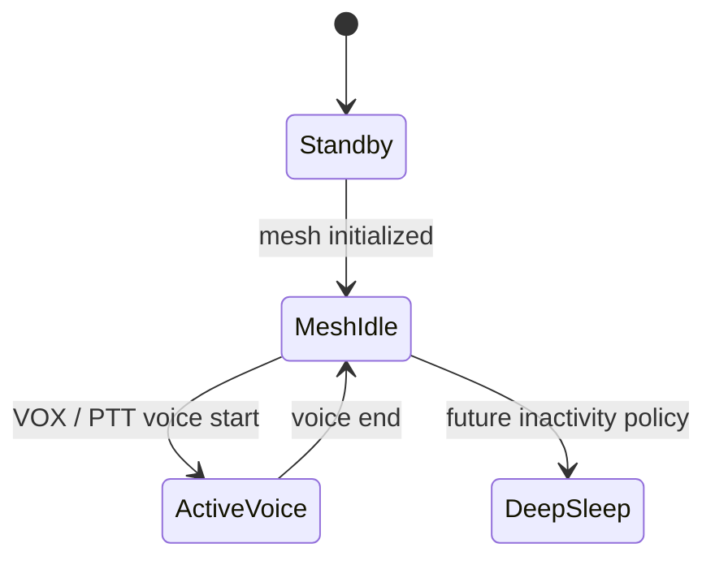

# Power Budget & Battery Design

This document separates OpenHelmet power goals from current firmware behavior and measurements. Power targets are acceptance criteria until they are reproduced on named hardware with a documented test setup.

[TOC]

---

## Goals and Evidence

### Product Goals

- Active riding: 8-16 hours
- Standby while powered on: multiple days
- Deep sleep: weeks

These are goals, not demonstrated runtimes.

### Current Evidence

| Item | Status |
|------|--------|
| ESP32-S3 active/idle current | A previous development-board observation recorded about 57 mA at 3.3 V with Wi-Fi listening; it is not a Rev2 system measurement |
| ESP32-S3 standby and deep sleep | Not measured for this project |
| nRF52840 ESB idle/RX/TX current | Not measured for this project |
| Rev2 charger/regulator efficiency | Not measured; hardware has not been brought up |
| Battery runtime | Not measured |

Do not derive a runtime claim from the 57 mA observation: it excludes, or does not characterize, the complete audio, radio, FEM, regulator, charger, battery, and workload configuration.

---

## Battery Design Inputs

Rev2 is designed around a single-cell Li-Po input:

- Nominal cell voltage: 3.7 V
- Full-charge voltage: 4.2 V
- Candidate capacity range: 1000-1500 mAh

Nominal stored energy is `capacity_Ah * nominal_voltage`, so these candidate cells contain roughly 3.7-5.6 Wh before conversion and load losses. This is a sizing input only. Supported runtime must be calculated from measured whole-device power over a representative ride profile.

---

## Implemented Firmware States

The ESP32 power component exposes these states and APIs:

| State/API | Implemented behavior | Current use |
|-----------|----------------------|-------------|
| `POWER_STATE_STANDBY` | Initial state and state accounting | Brief startup state; no validated low-power standby path |
| `POWER_STATE_MESH_IDLE` | State accounting and VOX transition origin | ESP-NOW enters this state when its mesh becomes active; the nRF transport does not yet make this transition |
| `POWER_STATE_ACTIVE_VOICE` | State accounting and voice activation statistics | Entered/exited through `power_notify_voice_start/end` |
| `POWER_STATE_DEEP_SLEEP` | State value used by explicit deep-sleep entry | No automatic transition calls it |
| `power_enter_deep_sleep(wake_after_sec)` | Configures an optional timer wake and calls ESP deep sleep | Implemented API, currently unused by application flow |
| `power_activity_ping()` / `power_get_idle_time_ms()` | Tracks activity and reports idle duration | Available, but not connected to automatic sleep policy |
| `power_radio_slot_start/end()` | Hooks for slot-scoped Wi-Fi power-save changes | Called by ESP-NOW scheduling, but disabled by default |

The nRF transport currently remains accounted as `STANDBY`. Its bridge status
path does not enter `MESH_IDLE`. This also prevents the current VOX power-state
helper from entering `ACTIVE_VOICE` on that transport. This is an integration
gap, not a low-power behavior.

There is a `deep_sleep_timeout_sec` configuration field whose default value is 300 seconds. It is not an active timer: no task checks it and no automatic 300-second deep-sleep transition exists.

The intended state model remains:



---

## Current Radio Behavior

### ESP-NOW Transport

- Wi-Fi power save is explicitly set to `WIFI_PS_NONE` for reliability.
- `configure_wifi_power_save()` ignores its aggressive/non-aggressive argument.
- The radio duty-cycle hooks return immediately with the default `enable_radio_duty_cycle = false` configuration.
- Silence suppression avoids local audio TX during silence, but the receiver remains available and this does not create a low-power mesh-idle state.

The current ESP-NOW path therefore has no validated radio-sleep power saving.

### nRF52840 ESB Transport

- A dedicated thread polls the ESP32 SPI bridge every 2 ms.
- ESB is configured at 2 Mbps and +8 dBm.
- The radio normally stays in RX, pauses for TX, and restarts RX immediately afterward.
- The nRF21540 control path is not implemented or validated in firmware.
- The nRF transport does not consume the ESP32 power-state or radio-slot APIs to coordinate a system-wide low-power state.

The current nRF transport is optimized for communication continuity, not measured minimum power. Slot-aware RX/TX duty cycling and coordinated ESP32/nRF sleep remain incomplete.

---

## State Definitions and Targets

### Deep Sleep

Goal:

- Radios and audio off
- Explicit wake source
- Whole-device current low enough to support the standby-duration target

Current status: ESP32 entry API exists, but application policy, wake-button behavior, nRF shutdown/wake coordination, and measurements are incomplete.

### Standby

Goal:

- Device powered, not joined to a mesh
- UI wake available
- Bounded periodic discovery rather than continuous receive

Current status: represented in the ESP32 state enum, but not implemented as a validated low-power operating mode.

### Mesh Idle

Goal:

- Maintain synchronization and membership
- Keep VOX monitoring available
- Duty-cycle radios where the protocol and hardware allow it

Current status: ESP-NOW has no Wi-Fi power save and nRF ESB uses continuous RX between TX operations. No whole-device mesh-idle measurement exists.

### Active Voice

Goal:

- Capture, Opus processing, playback, and scheduled radio operation active as needed
- Meet audio latency and reliability requirements within the final power budget

Current status: the software path is implemented, but current and energy per voice workload have not been characterized on Rev2.

---

## Rev2 Charging and Regulation

The Rev2 design includes:

- USB-C power input
- BQ24074 single-cell charger/power-path IC
- TPS63020 buck-boost regulator
- Li-Po connector with NTC input

Presence in the schematic and PCB does not establish correct operation. ERC/DRC closure, assembly, first-power checks, charge-current and termination validation, NTC behavior, rail sequencing, regulator stability, efficiency, thermal performance, and protection behavior are still outstanding. Do not connect an unattended battery until those checks are complete.

---

## Runtime Estimation

After measurement, estimate runtime with:

```text
runtime_h = usable_battery_energy_Wh / measured_average_system_power_W
```

The average must come from a representative workload, including mesh idle, speech duty cycle, relaying, audio output level, FEM mode, conversion losses, temperature, and battery derating. Until that data exists, the repository makes no supported 8-hour, 16-hour, multi-day, or other battery-runtime claim.

---

## Measurement Plan

For each prototype revision and firmware commit, record:

- Board and battery identity
- Input voltage, cell state of charge, and ambient temperature
- ESP-NOW or ESB transport and FEM state
- Current in startup, standby, mesh idle, local speech, receive/playback, relay, and deep sleep
- SPI poll activity and radio RX/TX timing
- Audio level, speaker load, node count, and packet workload
- Average, peak, and integration interval

Required Rev2 gates:

1. Validate charger and regulator without the MCUs populated or enabled where practical.
2. Bring up each rail with current limiting and thermal observation.
3. Measure ESP32-only, nRF-only, audio-only, and FEM contributions.
4. Implement and verify coordinated radio/power-state transitions.
5. Run representative discharge tests before publishing runtime figures.

Power regressions are functional regressions, but only reproducible measurements can establish the budget.
