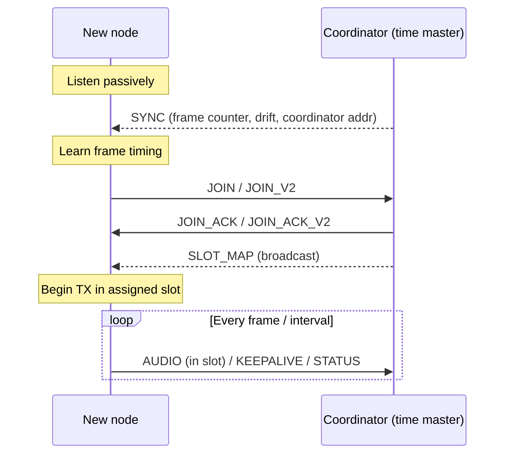

# OMI Protocol Specification (v0.1)

This document specifies the **on-air and inter-MCU protocol** for the Open Motorcycle Intercom (OMI).

The protocol is intentionally minimal, deterministic, and optimized for **real-time voice**, not general data transfer.

This specification covers:
- Packet types and formats
- Audio encapsulation
- TDMA frame usage
- Control messages

[TOC]

---

## Design Principles

- Deterministic latency beats throughput
- Fixed-size packets where possible
- Small headers, explicit fields
- Audio is first-class; everything else is secondary

---

## Terminology

- **Node**: One intercom unit (one rider)
- **Frame**: One TDMA cycle (aligned to Opus frame)
- **Slot**: Time window allocated to one node
- **Hop**: One wireless relay
- **Audio Frame**: One Opus-encoded 20 ms chunk

---

## Network Model

- Small, bounded mesh (2-10 nodes)
- Single logical group per mesh
- One active time master
- Multi-hop broadcast transport with TTL-bounded relaying (see "Relaying & Multi-Hop")

---

## Packet Overview

All packets share a common header.

### Common Packet Header (8 bytes)


| Offset | Size | Field | Description |
|------|----|------|------------|
| 0 | 1 | Version | Protocol version (0x01) |
| 1 | 1 | Type | Packet type |
| 2 | 1 | SrcID | Source node ID |
| 3 | 1 | Seq | Sequence number |
| 4 | 1 | TTL | Relay time-to-live (decremented per hop; 0 = no relay) |
| 5 | 1 | Flags | Control flags (see below) |
| 6 | 2 | PayloadLen | Bytes following header |

All fields are little-endian.

### Control Flags

| Bit | Name | Meaning |
|----|------|---------|
| 0x01 | RELAY_REQUEST | Source is requesting relays to forward this packet |
| 0x02 | RELAYED | Packet has already been relayed at least once |
| 0x04 | SPEAKER_GRANTED | Sender holds a coordinator speaker grant |

---

## Packet Types


| Type | Name | Purpose |
|----|------|--------|
| 0x01 | AUDIO | Opus audio data |
| 0x02 | JOIN | Request to join mesh |
| 0x03 | JOIN_ACK | Join response |
| 0x04 | LEAVE | Graceful leave |
| 0x05 | SYNC | TDMA timing sync |
| 0x06 | SLOT_MAP | Slot assignment |
| 0x07 | STATUS | Battery / health |
| 0x08 | KEEPALIVE | Presence check |
| 0x09 | SPEAKER_GRANT | Coordinator grants a speaker a relay/transmit slot |
| 0x0A | SPEAKER_RELEASE | Coordinator releases a previously granted speaker |
| 0x0B | JOIN_V2 | nRF/ESB join request with requester identity |
| 0x0C | JOIN_ACK_V2 | nRF/ESB targeted join response |

---

## Audio Packet

### Purpose

Carries exactly **one Opus frame**.

### Payload Format

| Offset | Size | Field | Description |
|------|----|------|------------|
| 0 | 1 | Codec | 0x01 = Opus |
| 1 | 1 | FrameMs | Frame duration (20) |
| 2 | 1 | StreamID | Logical audio stream |
| 3 | 1 | AudioFlags | Bit 0 = ACTIVE (speech); clear = intentional silence / comfort-noise frame |
| 4 | N | OpusData | Encoded audio (Opus, may be a small DTX comfort-noise frame) |

Typical payload size:
- 20-40 bytes @ 12 kbps active speech, up to 64 Opus bytes
- 1-6 bytes for comfort-noise (DTX) frames during silence

`AudioFlags` lets the receiver distinguish intentional silence from packet loss
(see audio.md §5.1). Pure 1-2 byte DTX frames are dropped before transmission, so
the radio stays quiet during silence.

The nRF transport prepends a two-byte end-to-end frame sequence to Opus data.
Its mesh audio capacity is therefore 66 bytes, while the codec limit remains 64 bytes.

### Rules

- AUDIO packets **must only be sent in TDMA slots**
- Late local slot work is dropped before submission; receivers validate packet format, state, source, and deduplication rather than reconstructing sender slot time

---

## TDMA Frame Usage

### Frame Parameters

- Frame duration: 20 ms
- Slot duration: configurable (1–3 ms)
- Guard time: implementation-defined

### Slot Ownership

- Each node owns exactly one slot
- Slot ID is implicit by position

### Transmission Rules

- One AUDIO packet per slot
- Silence = suppressed: only periodic comfort-noise (DTX) frames are sent, and pure
  1-2 byte DTX frames are dropped before TX (see audio.md §5.1)
- No retransmissions

---

## Relaying & Multi-Hop

Audio is **single-hop by default**: ordinary (ungranted) audio is **never
relayed**, which prevents flooding. Multi-hop relaying is a conditional path used
only for the currently-active speaker(s):

- When a node is actively speaking (sending ACTIVE frames), the coordinator grants
  it as an active speaker - up to `MESH_MAX_ACTIVE_SPEAKERS` concurrently - and
  broadcasts **SPEAKER_GRANT**. That speaker's audio then carries the
  `SPEAKER_GRANTED` flag. **SPEAKER_RELEASE** ends the grant when it goes idle.
- Only `SPEAKER_GRANTED` audio is eligible for relay. A per-speaker **relay mask**
  decides who relays: nodes that *heard* the speaker may relay it; nodes that did
  not hear it are the intended recipients. (Comfort-noise / silence frames are not
  ACTIVE, so they never trigger a grant or relay.)
- Relays are **TTL-bounded** (`MESH_AUDIO_TTL_DEFAULT` = 2, decremented per hop;
  TTL 0 is not forwarded) and **de-duplicated** by (Type, SrcID, Seq), so a frame
  is never re-relayed or looped. The `RELAY_REQUEST` / `RELAYED` flags coordinate
  this.
- Relayed AUDIO is sent in the relay node's own slot.

This is identical on both transports (ESP-NOW and nRF52840/ESB).

---

## Join & Sync Sequence



Dashed arrows are broadcasts (SYNC, SLOT_MAP). After joining, periodic
KEEPALIVE/STATUS keep the node's `last_seen` fresh so it is not timed out
(see "Node Loss"), independent of whether it is transmitting audio.

---

## Control Plane

Control packets are transmitted outside TDMA voice slots. For joined nodes, both
transports rotate control-window ownership by frame; every tenth frame is
reserved for coordinator SYNC. ESP-NOW keeps non-SYNC control in a bounded
priority queue and sends one item in an owned window. Before assignment,
ESP-NOW JOIN requests transmit directly with a minimum interval and random
jitter. ESP-NOW LEAVE also transmits directly during shutdown.

### JOIN Packet

Payload:

| Offset | Size | Field | Description |
|------|----|------|------------|
| 0 | 1 | Capabilities | Codec / feature bitmap (0x01 = basic Opus) |
| 1 | 1 | Reserved | Future use |

### JOIN_ACK Packet

Payload:

| Offset | Size | Field | Description |
|------|----|------|------------|
| 0 | 1 | AssignedID | Node ID (1-8) |
| 1 | 1 | SlotIndex | TDMA slot |
| 2 | 1 | CoordinatorID | Current coordinator (time master) |

ESP-NOW uses JOIN/JOIN_ACK because the receive callback supplies the sender MAC.
Nordic ESB does not expose a transmitter address, so it uses identity-bearing
JOIN_V2 and targeted JOIN_ACK_V2 packets instead:

| Packet | Additional field | Description |
|------|----|------|
| JOIN_V2 | RequesterAddr (5 bytes) | Stable nRF device/ESB identity used to deduplicate retries |
| JOIN_ACK_V2 | TargetAddr (5 bytes) | Only the matching requester accepts the broadcast ACK |
| LEAVE | SenderAddr (5 bytes, nRF) | Confirms that the departing node ID belongs to this ESB identity |

All nRF boards in a mesh must run firmware using the same JOIN handshake.

---

## Time Synchronization (SYNC)

### SYNC Packet

Payload:

| Offset | Size | Field | Description |
|------|----|------|------------|
| 0 | 4 | FrameCounter | TDMA frame number |
| 4 | 2 | DriftPPM | Estimated clock drift |
| 6 | 5-6 | CoordinatorAddr | Coordinator radio address, used for master-election tiebreak (6 bytes WiFi MAC on ESP-NOW, 5 bytes ESB address on nRF52840) |

### Behavior

- Master sends SYNC every 10 frames in the 16-18 ms control window
- Participants derive a frame epoch from valid coordinator SYNC, maintain frame history, apply bounded phase/rate correction, and reacquire after a large frame-counter difference
- Loss of SYNC triggers re-election

---

## Slot Map (SLOT_MAP)

Broadcast by master when:
- Node joins/leaves
- Reconfiguration needed

Payload:

| Offset | Size | Field | Description |
|------|----|------|------------|
| 0 | 1 | SlotCount | Number of slots |
| 1 | 8 | SlotIDs | Ordered node IDs, zero for an unused slot |
| 9 | 1 | ActiveSpeakerCount | Number of relay-granted speakers |
| 10 | 2 | ActiveSpeakerIDs | Relay-granted node IDs |
| 12 | 2 | RelayMasks | Per-speaker relay-node bitmaps |

---

## Status & Keepalive

### STATUS Packet

Payload:

| Offset | Size | Field | Description |
|------|----|------|------------|
| 0 | 1 | BatteryPct | Battery percentage (0-100, 255=unknown) |
| 1 | 1 | RssiDbm | Last measured RSSI (dBm) |
| 2 | 1 | PeerCount | Active peer count |
| 3 | 1 | FwVersion | Firmware protocol version |
| 4 | 1 | TemperatureC | Temperature in C (127=unknown) |
| 5 | 1 | HeardBitmap | Sources heard during the reporting interval |
| 6 | 1 | RelayBitmap | Sources relayed during the reporting interval |
| 7 | 1 | ActiveSpeakers | Number of active/granted speakers |

### KEEPALIVE Packet

Payload:

| Offset | Size | Field | Description |
|------|----|------|------------|
| 0 | 1 | BatteryPct | Battery percentage (0-100, 255=unknown) |
| 1 | 1 | Reserved | Future use |

---

## Failure Handling

### Audio Loss

- Missing frames are concealed by Opus PLC
- No retransmission

### Node Loss

- Each node tracks a per-peer `last_seen` timestamp, refreshed by **any** packet
  from that peer (AUDIO / KEEPALIVE / STATUS / JOIN).
- A peer is dropped after `MESH_NODE_TIMEOUT_MS` (3000 ms) with no packets; its
  slot is then freed and a new SLOT_MAP is broadcast by the coordinator.
- Implemented on both transports (ESP-NOW and nRF52840/ESB).
- Liveness is independent of voice activity: KEEPALIVE/STATUS continue during
  silence (every 500 ms on ESP-NOW, ~1000 ms on nRF52840), so a silent node is
  **not** dropped even though its audio TX is suppressed (see audio.md §5.1).

### Master Loss

- Coordinator loss is detected by SYNC timeout; nodes return to scanning.
- On a coordinator conflict, the node with the lower radio address wins
  (lexicographic `memcmp` of the address); the other demotes to participant.

---

## ESP32 - nRF52 Inter-MCU Protocol

### Transport
- SPI preferred
- ~UART acceptable for early prototypes~

### Message Types

| Type | Value | Direction | Purpose |
|----|----|----------|--------|
| AUDIO | 0x01 | Bidirectional | Audio data |
| STATUS | 0x02 | nRF → ESP | Mesh status |
| EVENT | 0x03 | nRF → ESP | Mesh events |
| COMMAND | 0x04 | ESP → nRF | Mesh commands |
| LOG | 0x05 | nRF → ESP | Debug logs |

The packet IDs and packed control/status payloads are shared in
`shared/bridge_protocol_defs.h`. Mesh START and STOP carry an 8-bit generation.
The ESP permits one lifecycle command at a time and retries that same generation
until a matching command ACK arrives or the attempt limit expires. ACK means the
nRF command worker applied the requested transition; readiness is reported
separately through STATUS and MESH_READY/MESH_STOPPED events.

STATUS reports protocol version, explicit `IDLE`, `SCANNING`, `JOINING`, or
`ACTIVE` state, role, node ID, slot, coordinator ID, and peer count. PEER_JOINED
and PEER_LEFT describe topology changes only and are not lifecycle readiness
signals.

### Frame Format

```
[SYNC:0xAA] [LEN] [SEQ] [TYPE] [PAYLOAD...] [CRC8]
```

- LEN covers: `SEQ + TYPE + PAYLOAD`
- CRC8 covers: `LEN + SEQ + TYPE + PAYLOAD`

SPI is full duplex. ESP-to-nRF audio is retained as a single in-flight frame and
re-presented until the nRF admission ACK pulse or a bounded timeout. Lifecycle
control can pass while audio awaits ACK. The nRF prioritizes outbound control and
only advances its control/audio queue after a successful SPI transfer, so a
failed transaction is retryable rather than destructive.

### Audio Message

| Offset | Size | Field |
|------|----|------|
| 0 | 1 | SrcID |
| 1 | N | OpusData |

---

## Versioning

- Major version increments break compatibility
- Minor version adds optional fields
- Version field in header enforces negotiation

---

## Status

The current wire version is `0x01`. Shared layouts are compile-time size checked;
there is no implemented optional-field negotiation or encrypted/authenticated mode.
